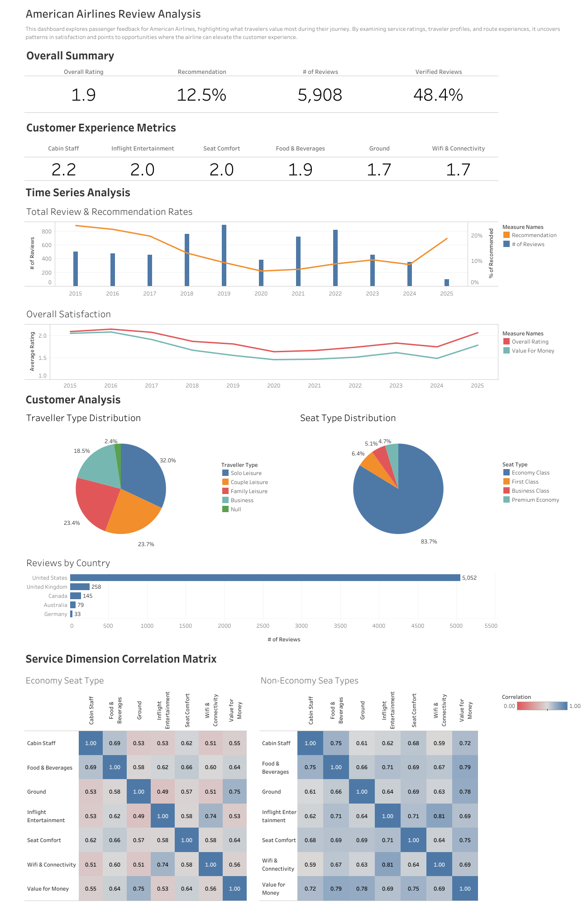

# American Airlines Reviews

Explore passenger feedback for American Airlines with a Tableau dashboard.
👉 [View Live Dashboard](https://quanh171.github.io/american-airlines-reviews-dashboard/)

Or have a quick look here 👉 

## 📌 Project Overview
This project analyzes **customer reviews for American Airlines** to uncover patterns in passenger satisfaction. The goal was to identify what service factors influence customer perception, and how different traveler and seat types experience the airline.

The work was done using **Excel and SQL (MySQL)** for data preparation and **Tableau** for visualization.

---

## 🛠️ What I Did
- Cleaned and prepared review data (handling nulls, standardizing column names).
- Built **SQL queries** to calculate overall satisfaction and pairwise Pearson correlations across service factors.
- Created a **Tableau dashboard** including:
  - KPIs (Overall Rating, % Recommended, # of Reviews, Verified %)
  - Service Experience Metrics
  - Time Series Analysis of reviews & satisfaction
  - Customer demographics (traveler type, seat type, nationality)
  - Correlation heatmap of service dimensions (Economy vs Non-Economy)

---

## 🔍 How I Did It
1. **Data Preparation**
   - Source: `FCT_REVIEW` and `DIM_CUSTOMER` tables.
   - Cleaned data, changed incorrect data types, and applied null values into empty cells to minimize chance of running into errors.
   - Ratings treated as 1–5 scale (1 = poor, 5 = excellent).
   - Created sub-tables for future uses.

2. **Correlation Matrix**
   - Applied filters to exclude null values.
   - Implemented Pearson correlation using SQL.
   - Segmented by Economy vs Non-Economy seats.
   - Exported results into Tableau as a highlight table heatmap.

3. **Dashboard Design**
   - KPI summary at the top for quick health check.
   - Trend lines to show long-term patterns.
   - Pie/Bar charts for demographic breakdowns.
   - Heatmaps for deep-dive into service relationships.

---

## 💡 Key Insights
- **Overall rating is low (1.9)**, with only **12.5% recommending** the airline.
- **Economy class dominates** reviews (~84%), but scores lowest on most factors.
- **Ground service and WiFi & Connectivity** are weakest areas (~1.7 each).
- **Value for money is closely tied to seat comfort and food & beverages**.
- **Non-Economy travelers** report stronger correlations among service factors, suggesting more consistent experiences.

---

## ✅ What Worked Well
- Successfully created a **correlation heatmap** in SQL + Tableau.
- Dashboard gives both **high-level KPIs** and **deep-dive analytics**.
- Combining **traveler profile + service ratings** provided clear context.

---

## ⚠️ What Didn’t Work / Limitations
- Lack of **detailed nationality data** (beyond country count).
- Some **review text (qualitative data)** wasn’t analyzed — could add sentiment analysis.

---

## 🎓 What I Learned
- Practical use of **Pearson correlation in SQL** for survey-like data.
- How to design a **storytelling Tableau dashboard** that mixes KPIs, demographics, and statistical analysis.
- Importance of **joining Tableau extracts with SQL results** using a dummy join key.

---

## 🚀 Future Improvements
- Add **sentiment analysis** on review text (using NLP).
- Automate **correlation recalculation in Tableau** using calculated fields or parameterized SQL.
- Include **benchmarking against other airlines** for context.
- Add **predictive modeling** (e.g., logistic regression) to estimate probability of recommendation.

---

## Repo Contents
- `dashboard/` → dashboard in PNG format
- `db/` → datasets used for this project
- `docs/` → HTML embed for GitHub Pages
- `screenshot/` → contains screenshots used for this project
- `sql/` → SQL for metrics finding and correlation matrix
- `twbx/` → Tableau packaged workbook (.twbx)
